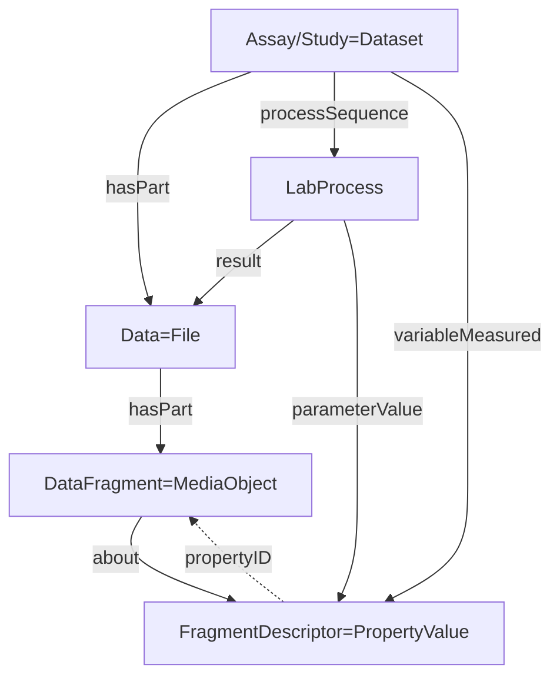

# ARC Datamap RO-crate profile DRAFT

## Abstract

This profile shows the inteded representation of the ARC datamap in the RO-Crate, extending the [ISA RO-Crate Profile](https://github.com/nfdi4plants/isa-ro-crate-profile). The datamap contains contextual information for fragments within data files. Data files are already referenced in their respective datasets through `hasPart` and connected to ISA processes as their output (`result`). We extend this by splitting data files into data fragments (using the same type `MediaObject` for the fragments and connecting them through `hasPart`). Furthermore, we add the contextual information per entry in the datamap to the `Dataset` objects. The fragments and their information then reference each other.

## Detailed Description

The current plan is to use `MediaObject` for data fragments and annotate them through the `variableMeasured` property in the assay/study `Dataset` object. Specifically, we plan the following:
- Each entry in the datamap becomes one entry in `variableMeasured` of type `PropertyValue`.
- Each data fragment becomes an object of type `MediaObject`, referenced from its file object through `hasPart`.
- The data fragments from the data map point to descriptions in form of a `PropertyValue` through the `about` property.
- The `PropertyValue` objects point back through `propertyID`, although this is not a valid jsonld link.

### Assay

Is based upon [schema.org/Dataset](https://schema.org/Dataset) and maps to the [ISA-JSON Assay](https://isa-specs.readthedocs.io/en/latest/isajson.html#assay-schema-json)

| Property | Required | Expected Type | Description |
|----------|----------|---------------|-------------|
|@type |MUST|Text|must be '[schema.org/Dataset](https://schema.org/Dataset)'|
|@id|MUST|Text or URL|Should be a subdirectory corresponding to this assay.|
|additionalType|MUST|Text or URL|‘Assay’ or ontology term to identify it as an Assay|
|creator|MUST|[schema.org/Person](https://schema.org/Person)|The performer of the experiments.|
|identifier|MUST|Text or URL|Identifying descriptor of the assay.|
|headline|MUST|Text|A title of the assay.|
|about|MUST|[bioschemas.org/LabProcess](https://bioschemas.org/LabProcess)|The experimental processes performed in this assay.|
|measurementMethod|MUST|URL or [schema.org/DefinedTerm](https://schema.org/DefinedTerm)|Describes the type measurement e.g Complexomics or transcriptomics as an ontology term|
|measurementTechnique|MUST|URL or [schema.org/DefinedTerm](https://schema.org/DefinedTerm)|Describes the type of technology used to take the measurement, e.g mass spectrometry or deep sequencing|
|hasPart|SHOULD|[File](https://schema.org/MediaObject)|The data files resulting from the process sequence|
|description|SHOULD|Text|A short description of the assay (e.g. an abstract)|
|variableMeasured|COULD|Text or [schema.org/PropertyValue](https://schema.org/PropertyValue)|Either a high level descrition of the target variable being measured (e.g. protein concentration) described as text, or a fragment description entry from the datamap as a [PropertyValue](https://schema.org/PropertyValue) followinf the fragment description profile.|
|dateCreated|SHOULD|DateTime|When the Assay was created|
|dateModified|SHOULD|DateTime|When the Assay was last modified|
|citation|COULD|[schema.org/ScholarlyArticle](https://schema.org/ScholarlyArticle)|A publication corresponding to this assay.|
|comment|COULD|[schema.org/Comment](https://schema.org/Comment)|Comment|

### Data (File)

Describes and points to a Data file, and maps to the [ISA-JSON Data](https://isa-specs.readthedocs.io/en/latest/isajson.html#data-schema-json)

| Property | Required | Expected Type | Description |
|----------|----------|---------------|-------------|
|@type |MUST|Text|must be 'File' or 'MediaObject'|
|@id|MUST|Text or URL|Should be the path pointing to the file./
|name|MUST|Text or URL|The name of the file.|
|comment|COULD|[schema.org/Comment](https://schema.org/Comment)|Comment|
|encodingFormat|COULD|Text of URL|Media format as a MIME type|
|disambiguatingDescription|COULD|Text|The type of the data file (“Raw Data File", “Derived Data File" or "Image File").|
|hasPart|COULD|[File](https://schema.org/MediaObject)|The data fragments within this file. They must follow the Data Fragment profile.|

### Data Fragment

Describes and points to a *Fragment* of a Data file. Doesn't have a correspondence in ISA.

| Property | Required | Expected Type | Description |
|----------|----------|---------------|-------------|
|@type |MUST|Text|must be 'File' or 'MediaObject'|
|@id|MUST|Text or URL|Should be the path pointing to the file with a [fragment selector](https://www.w3.org/TR/annotation-model/#selectors) attached.|
|usageInfo|MUST|Text of URL|(Formal) Description of the fragment selector.|
|about|SHOULD|[schema.org/PropertyValue](https://schema.org/PropertyValue)|The fragment description for this fragment. It must follow the fragment description profile.|
|dateCreated|SHOULD|DateTime|When the Assay was created|
|name|COULD|Text or URL|The name of the file.|
|comment|COULD|[schema.org/Comment](https://schema.org/Comment)|Comment|
|encodingFormat|COULD|Text of URL|Media format as a MIME type|
|disambiguatingDescription|COULD|Text|The type of the data file (“Raw Data File", “Derived Data File" or "Image File").|

### Fragment Description

It is based on [schema.org/PropertyValue](https://schema.org/PropertyValue) and doesn't have a corresponding ISA term.

| Property | Required | Expected Type | Description |
|----------|----------|---------------|-------------|
|@type |MUST|Text|must be '[schema.org/PropertyValue](https://schema.org/PropertyValue)'|
|@id|MUST|Text or URL||
|value|MUST|Text|Explication of the data fragment contents|
|valueReference|COULD|URL|Value ontology reference|
|propertyID|SHOULD|URL|Reference to the data fragement using a [fragment selector](https://www.w3.org/TR/annotation-model/#selectors)|
|unitText|COULD|Text|Unit of the data fragment|
|unitCode|COULD|URL|Unit ontology reference|
|description|COULD|Text|Can be used to describe further details of the fragment|